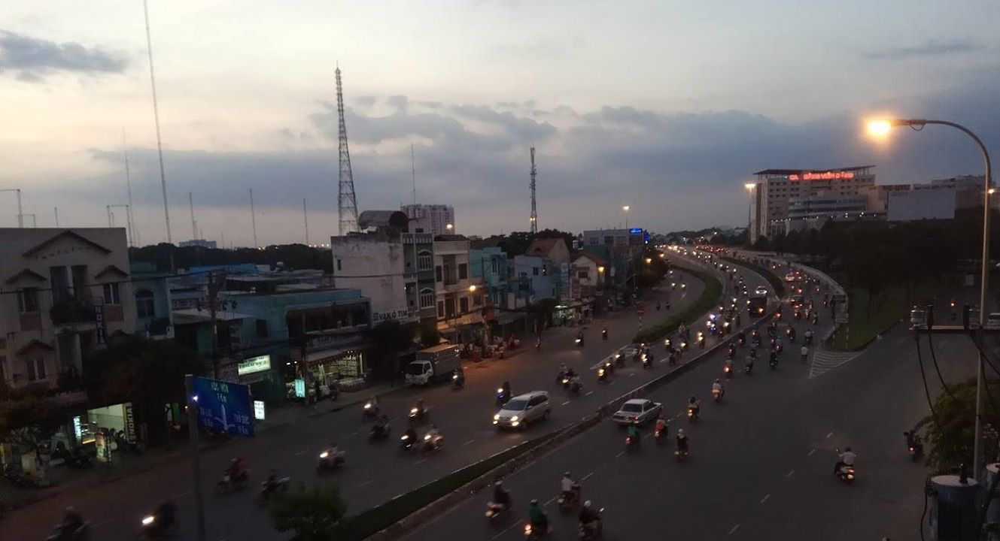

{.full-width}

Người lập trình, thấy được sức mạnh của máy tính, của Internet, của thời đại Công Nghệ Thông Tin, ai mà không có cái tham vọng biến mấy dòng code thành những giá trị vượt trội.

*Nhưng hôm nay chiều về hơi muộn.*

Ngày Google bắt đầu, đã có hơn hai mươi bộ máy tìm kiếm hoạt động. Trong tay họ là ba ý tưởng chính: thống kê nhiều hơn, dùng những liên kết để xếp hạng các kết quả, và đích đến phải là một trang tìm kiếm được tối giản với những từ khoá.

Không nghi ngờ gì với những công nghệ tuyệt vời được tính hợp trong Google, tuy nhiên về tổng thể, kế hoạch của họ thực sự đơn giản.

*Sự khác biệt nằm ở, trên tất cả, họ muốn làm ra một trang web có thể sử dụng tốt!*

{.full-width}

Dù cho đích đến hiện tại của họ có lẽ đã lớn hơn rất nhiều với tất thảy hệ sinh thái khổng lồ, nhưng ý tưởng ban đầu đó đã làm được rất nhiều điều, không chỉ mang đến khoản lợi nhuận khổng lồ mà còn thay đổi cách thế giới giao tiếp với thông tin, với Internet.

> Một ý tưởng có thể đã từng tồn tại trong quá khứ, không có nghĩa nó sẽ không hoạt động trong tương lai.

Đừng ngại làm cái mới, cũng đừng ngại làm cái cũ, hãy làm tốt cái mình muốn làm.

### Ý tưởng không nên là thứ níu giữ bạn bắt đầu.

{.full-width}

Tận hưởng những khoảnh khắc muộn của buổi chiều, như ngày hôm nay, thoảng nhìn ra dòng người ngược xuôi ngoài kia, chẳng phút nào ngơi nghỉ.

Vì giá trị của một sản phẩm công nghệ nằm ở giá trị mà nó đem đến cho người sử dụng.

Một startup làm ra tiền bằng cách thu hút người dùng nhiều hơn là những công nghệ nó sở hữu. Rõ ràng, những gì con người sử dụng ngày hôm nay vẫn chưa thể khiến một ai có thể tự hào. Còn rất nhiều các lĩnh vực chưa thực sự tìm ra giải pháp công nghệ, không khác gì các công cụ tìm kiếm trước Google.

Một lần nữa, nhìn ra dòng người ngược xuôi ngoài kia, chẳng phút nào ngơi nghỉ...

{.full-width}

> Làm điều mà bạn yêu thích, và những người xung quanh bạn yêu thích.

Đêm đến bao trùm dãy dãy cao tầng giữa lòng thành phố, đèn đường sáng dần lên.
Dừng lại, tìm cho mình phút nghĩ suy ở góc công viên yên vắng, trong bộn bề cuộc sống, lại khởi động cái laptop nhỏ, nhiều hoài bão, khi ngoài kia còn là tiếng kèn inh ỏi của hàng xe chen chút nối dài...

*Cảm hứng từ [Y Combinator](https://www.startupschool.org/).*
