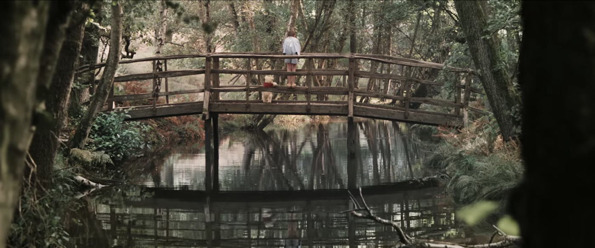

{.full-width}

Từ rạp chiếu phim về, tôi đang loay hoay với việc viết gì đó với những cảm xúc này, cái cảm xúc thật đặc biệt mà tôi chưa từng tìm thấy trong một bộ phim rạp nào khác. Mẹ tôi gọi, lâu rồi mới nhận được cú điện thoại của ai đó từ gia đình. Mẹ dặn tôi đừng thức khuya quá, đừng ngồi mãi một chỗ, nhớ ăn uống điều độ. Mẹ còn dặn nhiều thứ khác, có những thứ mà suýt nữa thì tôi đã quên mất chúng từng là thói quen của mình.

Cũng đã mấy năm tôi học xa nhà, chúng tôi thậm chí không còn nhiều điểm chung để mà chia sẻ với nhau khi có dịp gần gũi. Khoảng cách giữa chúng tôi lớn dần, nhưng tôi vẫn luôn gắng, chủ động hay bị động, không khiến nó xa quá, để mình còn có thể níu giữ được, tôi nghĩ tôi cần làm vậy.

Vừa mới hôm qua, tôi tìm thấy mình trong một ngày Sài Gòn lạnh lẽo.

> Tôi vẫn hay quan niệm mọi thứ cũ, nếu mình cứ để nguyên như thế thì mọi chuyện sẽ vẫn như thế, sẽ chẳng thay đổi, gặp lại vẫn thấy mọi thứ như chỉ ngày hôm qua mà thôi. Nhưng càng ngày càng nhận ra mọi thứ sẽ chẳng bao giờ như thế.

Ngày hôm nay, tôi lại tìm thấy mình, xem bộ phim Christopher Robin, trong tháng ngày thơ ấu mà tôi vô tình đánh mất. Thời thơ ấu về Nội ăn chơi cả tuần, có khi là vài tuần. Thời thơ ấu chạy đua với Lu Lu của tôi trên cánh đồng lúa sau nhà…

Nhưng điều lạ lùng là tôi không thể nhớ đâu là thời điểm chính xác mà cái thời thơ ấu ấy kết thúc. Khi tôi vào cấp ba? Hay sớm hơn khi tôi lên lớp chín và chơi với đám bạn ở trường nhiều hơn? Hay trước đó nữa? Chỉ biết rằng một ngày khi nhìn lại, nó đã chẳng còn ở đó nữa, phủi sạch, không còn dấu vết.

> Cuộc sống này thật quá. Mọi thứ ở xung quanh. Ngày nào đó sẽ chẳng còn như cũ nữa. Ngày nào đó tất cả sẽ biến mất.

Nhưng sẽ không hề gì, có phải không? Khi vẫn luôn có những phút giây hạnh phúc nhỏ nhoi này, sống lại những ngày thơ ấu ấy, khiến cái cô đơn lạnh lẽo, những cái bận bịu mệt mỏi trở lại cách xa cả ngàn năm ánh sáng.

Tôi nhớ rồi, tôi đã là người từng nhạy cảm đến mức khóc nức vì một của một con chuồn chuồn mà tôi bắt được bị chết, hay khi tôi lạc mất con chó nhỏ đã cùng tôi đi qua ngày thơ bé. Nhưng rồi năm tháng đã mang con người ấy cùng những thứ thuộc về anh ta đi đâu mất. Trải qua tất cả, thậm chí tôi đã nghĩ sẽ chẳng bao giờ mình khóc được, dù cho bất kỳ những nỗi đau “người lớn” nào ập đến tôi đi nữa.

Thế rồi bỗng nhiên đến ngày tôi thức giấc và thấy gối ướt đẫm vì mơ thấy mẹ tôi mất. Thế rồi bỗng nhiên đến ngày tôi khóc vì một bộ phim trên màn ảnh về một chuyện tình không thành. Thế rồi bỗng nhiên đến một ngày tôi khóc vì cô đơn và không có nơi nào để đi.

Thế rồi bỗng nhiên đến một ngày tôi đã lớn lên.

Vì thế sẽ chẳng hề gì, nếu tôi được phép sống câu chuyện của riêng mình và kết thúc cùng với nó, có phải không? Và thậm chí cho đến lúc chết, sẽ chẳng có cái chết nào chạm vào chúng ta được. Sẽ chẳng có điều tồi tệ nào ở đây khi ta còn sống, dù cho chúng ta, ở tương lai hay quá khứ, rồi sẽ lần lượt chia tay nhau mãi mãi. Sẽ chẳng hề gì, có phải không?

---

Tôi cũng chẳng thể nhớ nổi mình đã viết đoạn kết cho bài viết này vào lúc nào, hay đã đăng đâu đó trên mạng xã hội những khi trống rỗng. Bộ phim mang tôi tìm về với mảnh ghép này, cũng vừa vặn để khép lại câu chuyện ở đây, trong một ngày hôm nay đẹp trời.

Hẹn gặp lại, Winnie the Pooh của tôi!

{.full-width}
