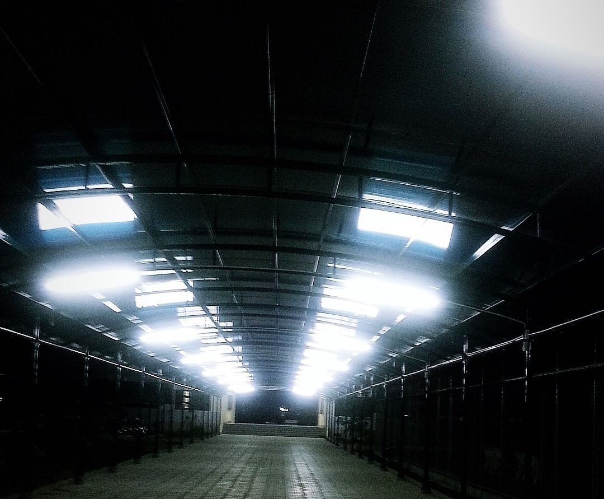

{.full-width}

Hồi tôi đi học, rất hay vào blog tên là `Heavenly Wind`. Tác giả là một anh tầm hơn tôi vài tuổi, chia sẻ nhiều thứ, truyện ngắn, tản mạn, nhạc, ảnh, MBTI… nhiều thứ. Đối với cậu trai như tôi lúc đó, là nhiều thứ.

Rất lâu sau này tôi có dịp kết bạn Facebook với anh, vào lại blog cũ, anh cũng đã bỏ không update vài năm rồi. Tôi có vài người cũng trải qua tuổi mơ mộng bằng cách hay ngó vào blog của anh. Rồi chúng tôi cùng vào đọc lại, như nhìn thấy những êm đềm mà chỉ vài năm trước chúng tôi vẫn được đắm mình vào đó.

Một năm trở lại đây, tôi nhận ra tôi không viết như trước nữa. Không phải là những dòng tản văn lãng mạn bay bổng như tôi đã từng như vậy.

Tôi cũng không hay viết về những điều mơ ước của tuổi trẻ, cũng chẳng viết về điều ngọt ngào của tình yêu. Những dòng chữ như ngắn lại, cô đọng và tĩnh mịch.

Rồi ai cũng sẽ khác, anh ấy cũng chẳng mãi là một blogger viết về gió thiên đường và tôi cũng sẽ chẳng còn là cậu trai trẻ vào đó để vẽ lên hình mẫu người tôi thích.

Có một hậu bối comment vào video cũ của tôi về trường cấp 3, ý ới gọi bạn bè vào để hét lên: “chúng mày ơi vào xem trường mình 10 năm trước này”. Cứ như thể ngôi trường bây giờ chẳng mang bóng hình gì của nó đã từng như vậy.

> Mọi thứ rồi sẽ thay đổi, điều đáng buồn là vì chúng ta cứ tưởng chúng ta vẫn giống ngày hôm qua, chúng ta của ngày mai vẫn giống của hôm nay nhưng 3 năm sau nhìn lại, mọi thứ đã bỏ ta mà đi mất rồi.

Điều gì sẽ còn ở lại đến cuối cùng?
