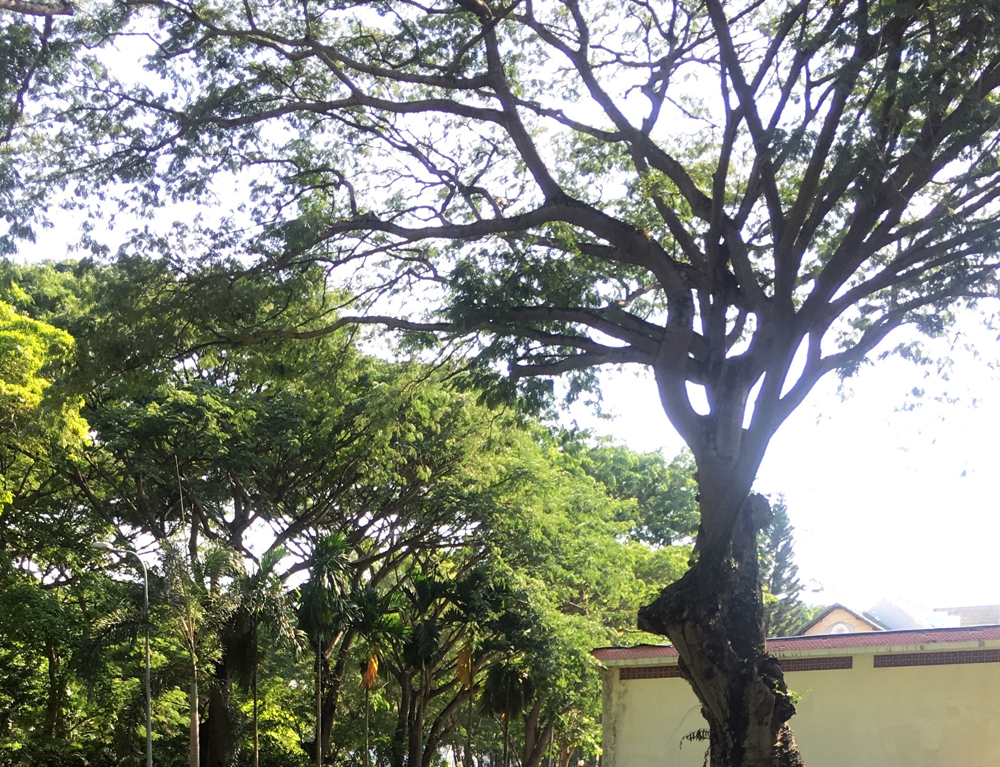

{.full-width}

Tôi rảo bước trong những suy nghĩ vỡ vẩn. Sài Gòn một buổi chiều có nắng, hơi oi và đông đúc những dòng người qua lại

Đôi khi có những điều bình dị lại khiến bản thân dao động vì những thứ đã tưởng như qua lâu lắm ấy.

Anh bạn tôi có một người bạn, thỉnh thoảng ảnh kể mấy chuyện vu vơ giữa hai người, tôi chỉ nghe như chuyện phiếm giữa anh và tôi.

Chiều nhẹ, có nắng và hơi oi, anh nói về tình bạn đó, đã qua, giọng như vọng lại từ nơi xa lắm.

Thế vậy, đôi khi những điều bình thường nhưng ẩn trong đó là tất cả tình yêu và tôn trọng.

Chiều nhẹ, tôi cũng không hỏi rằng chuyện vì sao. Uh, cái gì đã qua là đã qua, đã qua rồi.

> Tôi thỉnh thoảng tự hỏi về điều gì là quan trọng. Được yêu hay biết mình được yêu.
