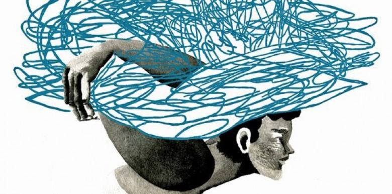

Tôi có một người bạn là huấn luyện viên thể chất. Một buổi sáng tháng Tám, anh tập luyện cho vài khách quen rồi về nhà và tự sát bằng một phát súng vào đầu.

Ngay cả với thị lực 20/20, tôi cũng chẳng thể đoán được anh lại có nguy cơ mắc trầm cảm nặng, chưa nói gì đến tự sát. Chỉ ba ngày trước khi chết, anh còn sôi nổi nói chuyện với tôi về việc sẽ mua căn nhà đầu tiên và nộp đơn vào một vị trí quản lý ở câu lạc bộ sức khỏe. Nhưng, như một người bạn thân của anh bảo tôi sau này, “Ta không bao giờ biết trầm cảm sống ở đâu.”

Hầu hết mọi người, ngay cả những người thân thiết với tôi, đều không thấy được bệnh trầm cảm của tôi. Tôi là một bệnh nhân trầm cảm “chức năng cao,” chắc chắn, và có lẽ còn là một bệnh nhân “kỹ nghệ” khi che giấu được các triệu chứng của bệnh bằng cách kết hợp giữa thuốc, trò chuyện trị liệu, tập thể dục, và biết được thời điểm nào thì nên đóng cánh cửa với thế giới. Và không như các vết sẹo mổ (cảm ơn mày, ung thư), trầm cảm để lại những vết sẹo vô hình.

Tôi tự hỏi rằng, nếu như tôi nói chuyện với bạn tôi về cuộc đấu tranh của mình, anh có nói “Tôi cũng thế” với tôi hay không. Chìm trong những suy nghĩ, tôi hình dung có lẽ hôm nay anh vẫn còn sống nếu chúng tôi cùng chia sẻ với nhau câu chuyện của mình.

-------

Trên đây là trích đoạn bài viết của Steven Petrow - Phóng viên mảng sức khỏe chia sẻ trên tờ New York Times với tiêu đề "Opening Up About Depression" - Tháng 8/2016.

Chắc hẳn còn vài người nhớ vào tháng 8/2014, danh hài Robin Williams đã tự sát vì trầm cảm. Danh hài, tự sát, trầm cảm, ba từ có lẽ không thể đi cùng nhau trong một câu nhưng thực ra lại phổ biến lắm. Vì chúng ta không cởi mở về trầm cảm. Chúng ta không kỳ thị nó nhưng lại có một định kiến rằng "họ không thể nào bị trầm cảm", và chữ "họ" đó có thể là rất nhiều người, một anh chàng vui vẻ trong cơ quan, một cô gái trồng hoa yêu đời. Ta không tin rằng họ có thể đang trầm cảm, một cách vô thức thông qua những câu khẳng định vô tư. Chúng ta còn không cho phép họ được quyền trầm cảm. Chúng ta đang biến trầm cảm trở thành một cuộc chiến đơn độc, thực sự đơn độc.

{.full-width}
