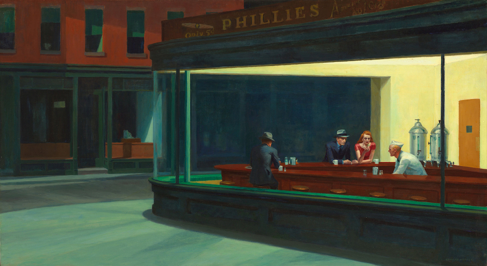

{.full-width}

Tôi là kiểu người thích nói chuyện bằng chữ chứ không phải bằng lời.

Mấy hôm nay bạn bè tôi hay dùng một công cụ để xem lại những tin nhắn Facebook đầu tiên với một ai đó, mới nhận ra mình đã quên mất tính năng này bao lâu nay.

Ngồi xem lại những tin nhắn, thật kỳ lạ rằng bản thân có thể nhớ từng mẩu chuyện nhỏ trong 6 vạn 9 nghìn câu lộn xộn các icon mà thầm cười vì nó.

Tôi vẫn nhớ tình cảm đầu tiên hồi cấp 3, tôi thức nghe cô ấy kể về người yêu đến hơn 4 giờ sáng mà vẫn nhẹ nhàng nhắc đi ngủ sớm. Hay nặng lòng kể với anh bạn thân những chuyện không thành.

Lại nhớ hồi năm 2016, khi Yahoo thông báo sẽ xóa tất cả dữ liệu về Yahoo Messenger, tôi đã dành cả đêm, thức đến 3h rưỡi sáng chỉ để tải lại ứng dụng, ngồi đọc những đoạn chat cũ, lưu những câu chuyện dài đến cả nghìn trang thành từng file, lưu theo tên từng người.

Kết thúc tuổi trẻ, có lẽ sau blog ở Wordpress (và trang KQP này) thì những đoạn chat kia là điều tuyệt vời nhất tôi còn giữ lại để đến lúc già sẽ mở ra mà mân mê.

Ngồi điểm lại nick của bạn bè, những nick cũ xám xịt, mà phải đến 80% trong số đó đã bước ra khỏi cuộc sống hiện tại.

Những mối quan hệ ấy không phải không muốn giữ mà không thể giữ được. Rồi đến lúc Y!M bị xóa sổ thì hình như tôi chẳng còn gì về họ, mọi thứ, cứ như chúng ta chưa bao giờ gặp, chưa bao giờ biết nhau, chưa bao giờ trò chuyện.

Tự nhiên nhận ra bản thân coi trọng kỷ niệm hơn những gì tưởng tượng. Con người rồi sẽ thay đổi, mọi mối quan hệ rồi sẽ kết thúc, chỉ có kỷ niệm là đẹp theo cách nhớ của mỗi người.

Yahoo như cái thứ cất cả tuổi trẻ của thế hệ 9X, gói vào trong bọc rồi giờ đây đem xé tan đi mất.

Mà sau tất cả, những gì chúng ta còn lại chỉ là những dòng tin nhắn ngọt ngào từng viết cho nhau.
