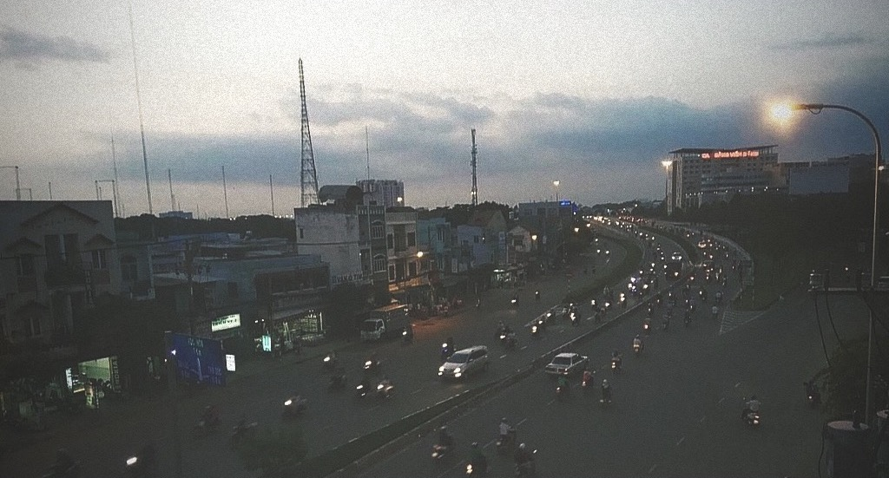

Lắm lúc khi không còn muốn mở quán nhậu, tôi vẫn thường hay muốn mở một quán cà phê nhỏ bán bánh ngọt. Quán sẽ không đông, cũng không kéo quá nhiều khách hàng. Tôi chỉ cần một góc thật nhẹ nhàng, để bạn bè có thể cùng nhau ngồi trò chuyện, ăn bánh, uống trà, nhấm nháp cà phê. Đó sẽ là một cửa hàng cà phê và bánh nhỏ, nằm khuất trong 1 con hẻm ở trung tâm Sài Gòn. Bạn có thể đi xe buýt rồi đi bộ tới đó, hoặc chạy xe vào hẻm, một nơi khác xa cuộc sống tấp nập ngoài kia.

Quán sẽ không quá lớn, nhưng đủ ấm để người ta không thấy cô đơn, đủ đầy để người ta không thấy chơi vơi. Một nơi để ai đó đến, và trở lại.

Một nơi sẽ luôn tiếp đón bạn cả ngày nắng tới đêm dài, bật những bản nhạc Jazz hay nhạc của những năm 50 – 60 của thế kỷ trước. Có vẻ âm nhạc không hợp lắm với khung cảnh, nhưng tôi vẫn muốn đan xen mọi thứ vào nhau. Kiểu như bạn gọi món, nhấm nháp từng chút một và nghe ca sĩ hát rõ ràng từng từ một. Không phải kiểu nhạc xình xập, dồn dập bây giờ. Những giai điệu sẽ cất lên nhẹ nhàng, trong một quán cà phê nhỏ của những ánh đèn neon mờ.

Tôi vẫn còn một quãng đường khá xa để mở ra quán cà phê của mình, mà cản trở chủ yếu là khi quán nhậu còn chưa thành. Cũng như tôi vẫn còn rất nhiều dự định trong chuyến hành trình sắp tới. Những dự định không quá xa vời, nhưng đủ để người ta mỉm cười hạnh phúc và bước qua ngày mới. Khi cuộc đời này bộn bề quá, thì người ta vẫn hay tìm những bình yên như vậy.

{.full-width}

Như ngồi lặng trong một quán cà phê và nhìn đời trôi, từng giọt khẽ khàng.
