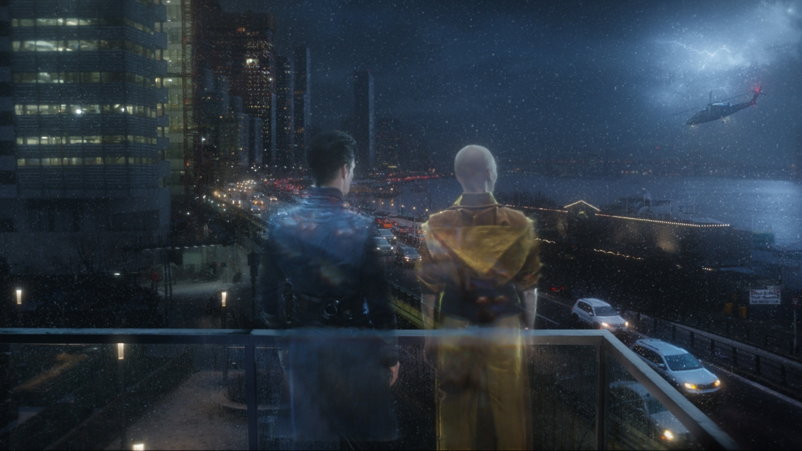
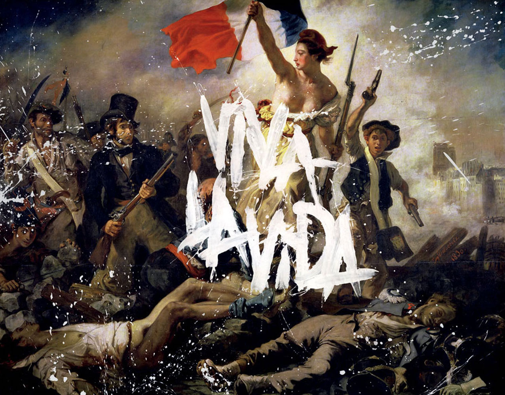
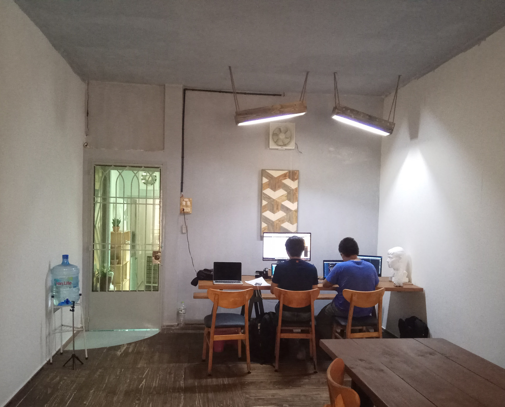

{.full-width}

> Cái chết làm cho cuộc sống trở nên ý nghĩa, rằng bao nhiêu tháng ngày vẫn chỉ là những con số, rằng cái gọi là thời gian luôn luôn bị giới hạn.

Đi hết ngày dài, đôi vai cũng mỏi. Tựa lưng vào góc cà phê quen, vây quanh bởi ánh đèn toả vàng, bản "[Death And All His Friends](https://open.spotify.com/album/1CEODgTmTwLyabvwd7HBty)" vang êm, chỉ khiến tôi lại muốn mở ngay cái laptop mà gõ mấy nhịp hối hả khẽ khàng.

### Công việc, tình cảm, gia đình

Làm sao để dừng lại ở đâu đó mà cho phép mình chép ghi vội mấy dòng tâm tư chỉ kịp lướt qua rất khẽ, mà thức dậy muộn hơn mấy mươi phút mỗi sớm hôm để khỏi phải ngắm ánh bình minh, mà bắt chộp được khắc khoảnh dãy đèn công viên đang sáng dần khi màn đêm buông xuống.

{.full-width}

...Mà chẳng ngó ngàng tới những thứ quanh mình dù chỉ một phút giây, chỉ để lắng nghe Viva La Vida cả đêm dài.

Cuộc sống không hẳn đã ngắn ngủi, sống là điều dài nhất người ta có thể thực hiện.

### Thiên đàng

Khoảng thời gian này tôi thực sự yêu thích và tin tưởng vào những gì mình đang làm, dù một lỗi chương trình, một thiếu sót nhỏ, hay một thế lực kỳ lạ nhiều khi chẳng thể giải thích được có thể khiến cả hệ thống ngừng hoạt động và mất cả tuần để giải quyết.

Dù cho công việc bộn bề có khiến bản thân nhiều muộn phiền.

Thiên đàng là nơi code ngự trị. Code là bài thơ buồn, code là bản nhạc du dương.

> And… in the end we lie awake, and we dream of making our escape

Và dẫu, ừ thì có hơi quen thuộc, code là nghệ thuật, mặc ai đó có nói gì, người viết code vẫn là một nghệ sĩ.

{.full-width}
