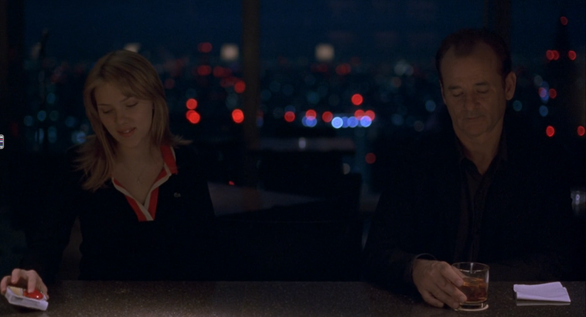

{.full-width}

Hai đứa thỉnh thoảng nói chuyện phiếm với nhau.

Sau này, nếu tôi và cô ấy có lỡ vẫn thích ở một mình, cô sẽ lên Đà Lạt mở một quán café nhỏ. Còn tôi là lão trồng hoa già. Hàng sáng, lão nông dân tặng cô chủ nhỏ một bông hoa rồi ngồi uống tách café, mở máy tính code vài dòng nhâm nhi cuộc sống. Cuộc đời sao quá ngắn mà nỗi niềm chúng ta lại quá dài. Vậy nên hai đứa quyết định cứ tận hưởng chầm chậm nó.

Mặc dù vậy, tôi là người coi trọng công việc và luôn cố phát triển nó, còn cô ấy, có lẽ cũng còn nhiều mối quan tâm khác.

Cũng chẳng sao, những câu chuyện phiếm giữa hai đứa vẫn luôn không đầu, không cuối và không cần tương lai như vậy.

Tôi có vài mối quan hệ như thế.

Nói giống không phải ý rằng họ cũng thích lên Đà Lạt, hay tôi cũng thích tặng hoa cho họ. Giống ở cách chúng tôi làm bạn với nhau.

Đôi khi thay vì gọi bạn bè theo mức độ thân thiết, có những người bạn tôi thường gọi là “Bạn ~~nhậu~~ cà phê”. Cũng không phải chúng tôi thích uống café, thỉnh thoảng uống trà đào cam sả, hay… bia nữa, để giết thời gian.

Đây chỉ là cách tôi gọi mỹ miều cho những mối quan hệ tôi không biết gọi tên.

Những người bạn này, tôi không thể gọi họ là bạn thân, chúng tôi không gặp nhau thường xuyên, không mồm năm miệng mười, không kề vai khoác cổ, không chửi nhau liên hồi, cũng chẳng trầm tư cho những phút giây mệt mỏi mềm yếu. Họ cũng khác xa những mối quan hệ xã giao, gặp nhau chỉ hỏi vài câu vu vơ công việc, liên lạc vì có việc nhờ vả, làm ăn hay thú vị hơn nữa là mời đi làm đa cấp.

Tình bạn của chúng tôi, như ở một thế giới riêng, nơi mà thời gian và không gian chẳng phải là vấn đề. Có thể vài tuần gặp một lần, có thể cả năm gặp một lần, nhớ nhau thì gặp. Dành một buổi tối rảnh rỗi trong một quán café nhỏ để mỗi đứa có thể nói linh tinh.

Đôi khi chỉ là vài câu chuyện vu vơ về những điều vừa trải qua, đôi khi chỉ lan mang hững tâm sự mà người kia không bao giờ là một phần trong đó. Chỉ là chúng tôi muốn thoát ra khỏi những ngổn ngang của cuộc sống bằng những mơ mộng của tuổi trẻ.

Có vẻ như đủ sự xa lạ cần thiết để mỗi đứa không bị ảnh hưởng bởi những tâm sự của nhau nhưng lại có nhiều điểm chung để mỗi đứa có thể gật gù và sống thêm một cuộc sống của người khác.

Cái cách chúng tôi làm bạn, cũng giống như những con người va phải nhau trong dòng người. Có thêm thời gian cúi xuống sửa sang lại giày dép, ngắm nghía lại bản thân, rồi tiếp tục con đường của riêng mình. Chỉ như vậy thôi nhưng lại ngọt ngào đến không tưởng. Có lẽ vì cuộc sống này bận rộn quá lại khiến những mối quan hệ này trở nên thú vị và đặc biệt như thế.
