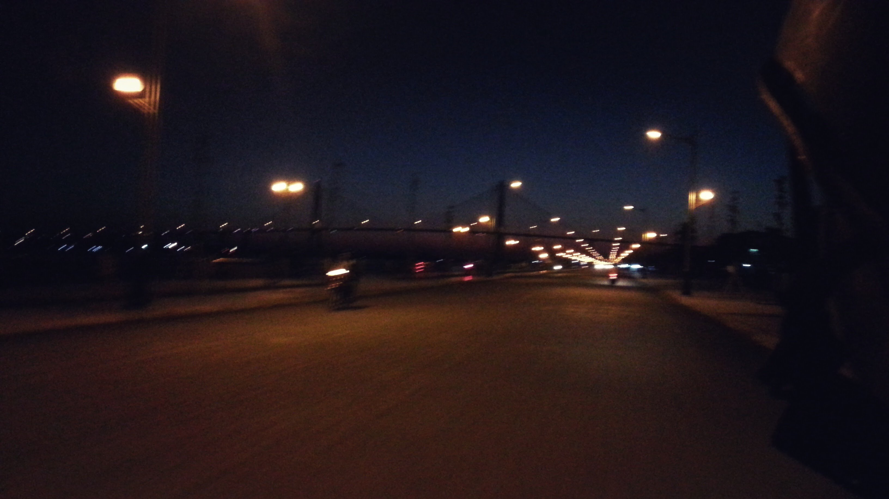

{.full-width}

Mấy hôm nay sửa soạn blog mới, lục lọi lại những tâm tư cũ, phần nhiều đã thất lạc, nhưng những dòng cảm xúc mà tôi từng trân trọng nhất thì vẫn còn vẹn nguyên đó. Rồi lọc lại xem cái nào nên đăng, cái nào nên giữ cho riêng mình. Những năm tháng thời học sinh, rồi những ngày đầu ở Sài Gòn, làm những công việc mới, gặp những người bạn mới,…

Là khi tôi nhận ra trong trí nhớ của mình, tôi vẫn luôn thích những cuộc hẹn bất chợt, những tin nhắn rủ nhau đi chơi, gặp nhau một chút, uống vài lon bia, nói chuyện vài câu.

Nhiều lúc chợt thấy chúng tôi cần gặp nhau chẳng vì điều gì cả, cũng chẳng cần một kế hoạch, quan trọng là gặp được nhau cái đã.

Tôi và bạn than thở với nhau trên facebook, hai đứa nói chuyện dài dòng, về những câu chuyện mới, về thế giới quanh chúng tôi, về công việc, học tập, về bạn bè, về tương lai và những điều xa xôi, nhưng lại chẳng hẹn được một lúc ngồi cùng nhau mà nói về những điều ấy.

Tôi cùng một người bạn đi chơi, những lúc đã lâu lắm rồi mới ở bên cạnh nhau, nói những thứ linh tinh, làm những điều bình thường, rồi lại cùng nhau trong im lặng, sẽ còn bao lâu nữa cả hai lại được cùng nhau, ở một nơi xa lạ như thế này, liệu còn bao nhiêu lâu nữa. Liệu chúng tôi có còn đủ gần gũi để nghĩ rằng “quan trọng là gặp được nhau”.

Có những nỗi sợ hãi trong im lặng, uh thì giống như tất cả điều biết rằng nó sẽ xảy ra, và một lúc nào đó chúng tôi sẽ phải quen dần với nó, hoặc một lúc nào đó chúng tôi nhận ra đã trót quen dần với nó.

Nỗi sợ hãi của những con người đang trưởng thành, là sợ mọi thứ sẽ thay đổi.
