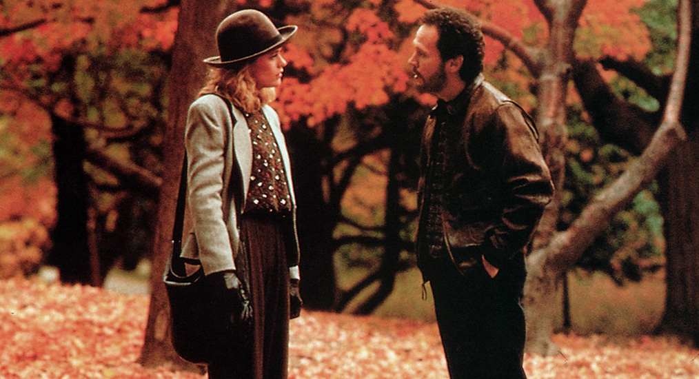

Càng lớn lên và càng có nhiều trải nghiệm về tình yêu, tôi càng cảm thấy rằng tình yêu xuất phát từ tình bạn dễ tan vỡ hơn, nhưng nếu có thể, thì sẽ là một tình yêu bền chặt lâu dài và thật sự hơn. Tôi nhớ đến câu nói của Joan trong The Imitation Game (2014) khiến bộ phim đó trở nên rất đặc biệt, “chúng ta sẽ có tâm trí của nhau”, khi cô bỏ qua cả vấn đề giới tính, hoặc quan niệm thông thường, để chấp nhận Alan.

Tình bạn, khác với tình yêu, không được xây nên bởi những ảo tưởng và hấp dẫn về giới tính rồi sẽ chóng tàn khi tuổi trẻ qua đi, mà phải là từ những lớp nền vững chắc hơn, từ sự đồng điệu về tâm hồn, từ sự tôn trọng, từ một lý tưởng chung, từ sự hợp ý hoặc dễ dàng trò chuyện và sẻ chia… những thứ sẽ không mất đi theo thời gian. Harry nói rằng “không có tình bạn giữa nam và nữ vì luôn có tình dục chen vào”, dù vậy, tôi cho rằng tình bạn là thứ không thuộc về bản năng, tự do, không bị bản năng quấy nhiễu.

Dạo gần đây, tôi không còn tin lắm vào những tình yêu bị ái tình và cuồng say làm che mắt, như Romeo and Juliet, như một ảo tưởng, và nghiêng về những tình yêu bình dị và xuất phát từ cuộc sống thường nhật như When Harry Met Sally, hay sau này là một phim có chung không khí Silver Lining Playbook (2013). Một kịch bản được xây dựng tuyệt vời, cả về tình bạn, cả về tình yêu, hài hước, lãng mạn và xúc động, When Harry Met Sally, cũng như mọi bộ phim xuất sắc khác, giống như rượu, cứ hay mãi, và gắn bó theo thời gian.

Như đêm hôm qua, khi đang bước lên con đường vòng để đến bãi đỗ xe, phía sau là ánh sáng mờ hắt ra từ rạp chiếu phim vắng lặng, tôi bỗng nghe như có giai điệu của “It had to be you” vang lên. Tôi bèn lẩm nhẩm hát theo Frank Sinatra, và tự buồn cười về chính mình. Nhưng nó khiến một buổi tối bình thường mang màu sắc của đêm cuối năm, tôi trở về nhà với tâm trạng của một gã trung niên trên đường đến tỏ tình người mình yêu. Rồi những nỗi cô đơn chợt trở nên ngọt ngào.

> For nobody else, gave me a thrill.
> With all your faults, I love you still.
> It had to be you, wonderful you.
> It had to be you.

{.full-width}
